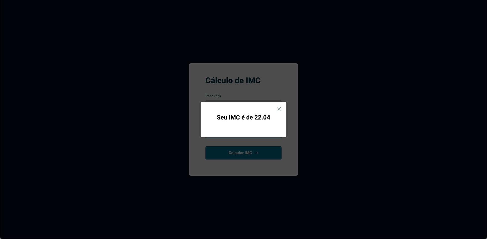
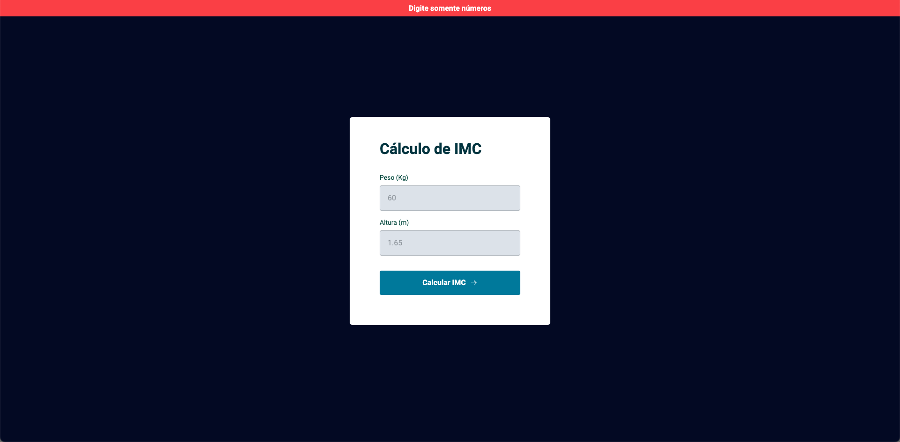

<h1 align="center"> Projeto - Calculadora de IMC</h1>

Hora de se desafiar ainda mais e colocar em prática o que foi ensinado na primeira fase do stage 05 e o que foi visto nos stages anteriores.

  <a href="#-tecnologias">Tecnologias</a>&nbsp;&nbsp;&nbsp;|&nbsp;&nbsp;&nbsp;
  <a href="#-projeto">Projeto</a>&nbsp;&nbsp;&nbsp;|&nbsp;&nbsp;&nbsp;
  <a href="#-layout">Layout</a>&nbsp;&nbsp;&nbsp;|&nbsp;&nbsp;&nbsp;

  

 

## 🚀 Tecnologias

Esse projeto foi desenvolvido com as seguintes tecnologias:

&nbsp;
&nbsp;
&nbsp;

## 💻 Projeto

É um projeto chamado Calculadora de IMC, no qual o usuário, a partir do input da sua altura e peso, obtém o resultado do seu IMC.
A aplicação também possui validação de dados e mensagens de erro.

## 🔖 Layout do projeto

 
 

 
 

 
 

Link do Figma:
 
https://www.figma.com/file/TLQIhShkpFa6ZE1kl1oQ6a/IMC-Copy?fuid=862035319941794750

 

## Aprendizado

- Estrutura de dados HTML
- Criação de Modal com CSS
- Estrutura de dados JavaScript
- Funções no Javascript
- Manipulação da DOM
- ES6 Modules
- Funções _callback_

 
 

🚀 by Paulo Henrique A. Stabelino.
